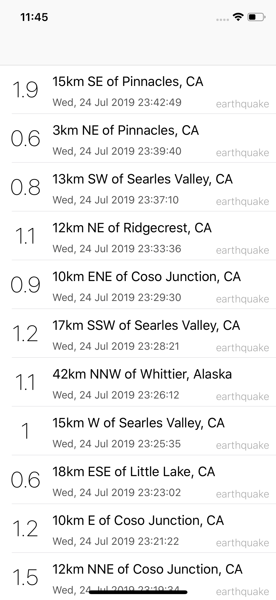
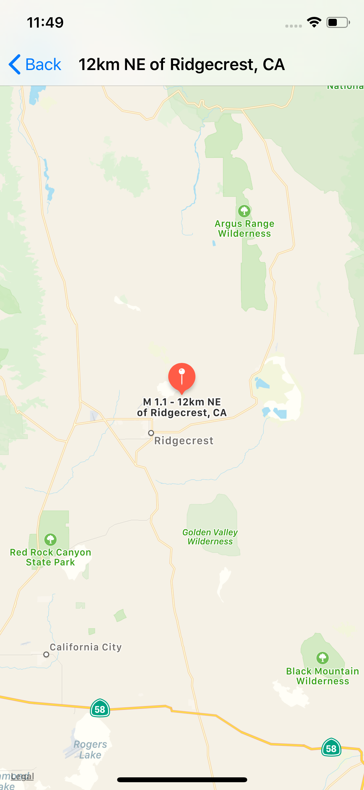
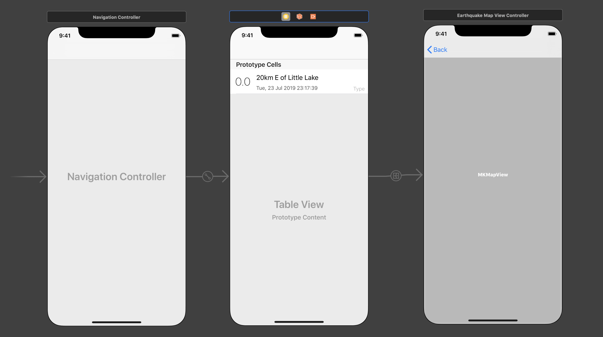

# QuakePlot

`QuakePlot` is a basic iOS application which displays a feed of recent earthquakes to occur in the US. It was developed over a day as part of a workplace exercise.

    
    

Earthquake data is fetched from USGS:

https://earthquake.usgs.gov/earthquakes/feed/v1.0/summary/all_hour.geojson

## Dependencies

QuakePlot was developed in Objective-X using Xcode 10.1. It uses the following third-party packages (managed via `CocoaPods`):

### Mantle

`Mantle` trivializes the task of constructing a model layer for iOS applications. Its primary use case in `QuakePlot` is to map the earthquake geojson features to `Earthquake` Objective-C object instances.

### AFNetworking

`AFNetworking` is a simple yet powerful networking library with a low boilerplate footprint. Its primary use case in `QuakePlot` is to perform a `GET` request and fetch the latest earthquake events.

## Installation

1. Clone this repository and cd into the directory
2. Run the command `pod install` to install all dependencies
3. Run the command `open QuakePlot.xcworkspace` to open the project in Xcode
4. Build and launch the app via `Product > Build`

## Design Decisions

### Light View Controllers

`EarthquakeServiceProtocol` was created to manage the retrieval, deserialization and creation of `Earthquake` models. This allows `EarthquakeTableViewController` to only deal with presentation logic.

### Dependency Injection

`EarthquakeTableViewController` is developed against the `EarthquakeServiceProtocol` protocol, which allows us to inject different implementations of the protocol during runtime if required. This can especially be useful when testing out controller, as we can inject dummy implementations which carry out specific test scenarios.

## Storyboard

    

## TODO

* Unit tests
* UI tests
